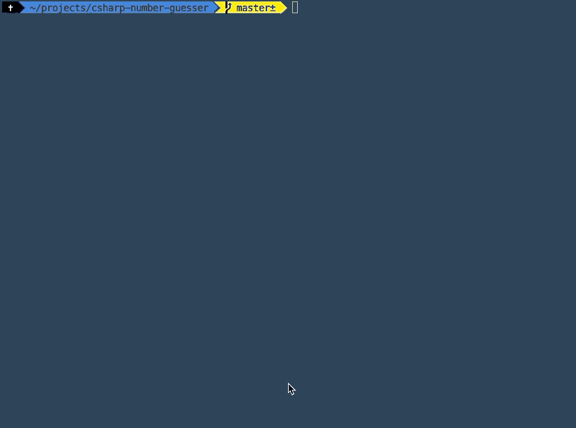

# C# Number Guesser Console App

### Summary

This was my first project working with C#! My first back end language was Ruby, and the first thing I made with it was a [console app](https://github.com/DylanAttal/numberguesser) that had users pick a number and the computer performed a binary search to guess it. I decided that my first C# app would be a spin on that. This time, I had the computer pick a random number between 1 and 10, and the user guessed it. C# and Ruby are certainly different, but it's true that the underlying concepts in programming are the same. I'm looking forward to adding C# and .NET Core as tools to my programming toolset!

### Project Goals

- [x] Create a console app with .NET Core
- [x] Ask the user's name
- [x] Have the computer pick a random number between 1 and 10
- [x] Have the user guess numbers until they guess correctly
- [x] Provide feedback on each guess saying whether it's right or wrong.
- [x] Change console text color based on whether the guess is right or wrong

### Technologies Used

C#, .NET Core
